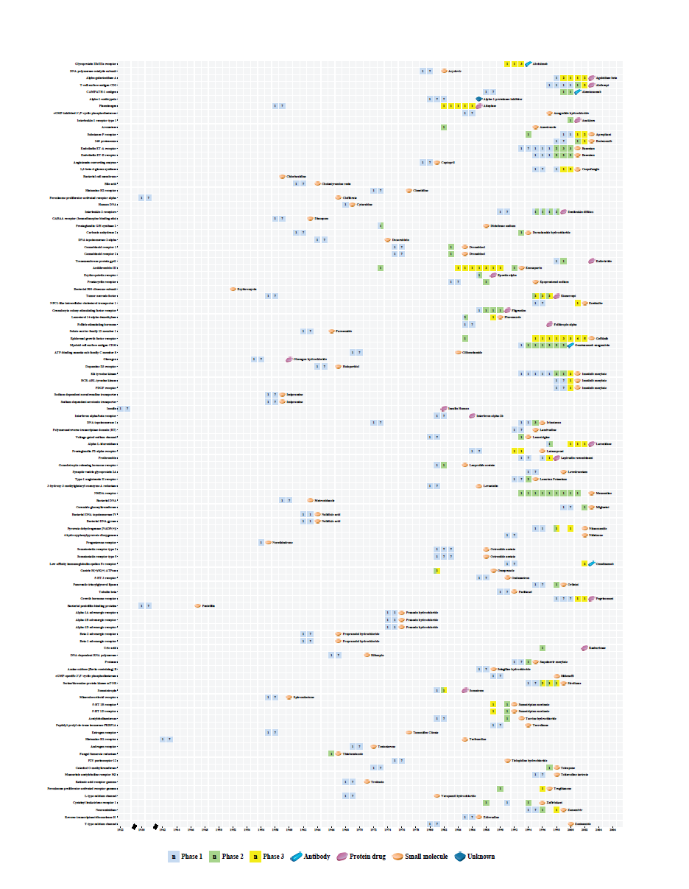
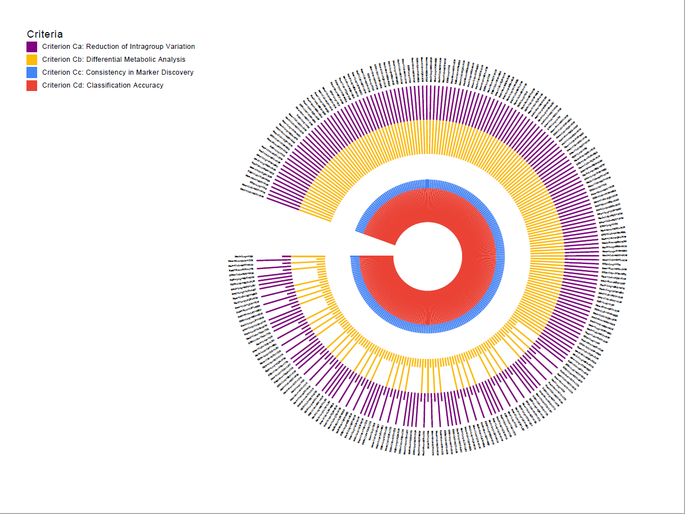

#  Basic Software Information

| Title         | Content            |
| :------------ | :----------------- |
| Software Name | BioJar 3.8.5       |
| Version       | 3.8.5              |
| Updated       | Sep, 09, 2020      |
| Author        | Zhang Hongning     |
| Email         | zhanghn@zju.edu.cn |
| Description   | a biological analysis java tool|
| ScreenCut     ||


#  Software Installment And Start
## Requirement environment for this software
&emsp;&emsp;**Operation System**: Window XP/7/8/10, Linux for Desktop(e.g. Unbuntu 18.04) and so on

&emsp;&emsp;**Program required**: Java Running Environment(JRE) >= JRE 14 or Java Development Kit(JDK) >= JDK 14, blast >= 2.10.1.

## Installment
&emsp;&emsp;No need for installment

## Start Software
&emsp;&emsp;**Command line start** :To start the software from the command line, go to the dist folder and type the following:
```
java -jar "BioJar 3.8.5.jar"
```
&emsp;&emsp;**Double click start** :To start the software from file manager, set the default method to open jar file with "%JAVA_HOME%\bin\java.exe"


#  Software Usage
## Keyboard ShortCut And Function Summary

| Function                               | ShortCut       | Description                                               |
| :------------------------------------- | :------------- |:--------------------------------------------------------- |
| Open                                   | Ctrl + O       |open file                                                  |
|Save                                    |Ctrl + S        |Save current selected file                                 |
|Save as                                 |Ctrl + Alt + S  |Save current selected file to new file                     |
|Close file                              |Ctrl + Q        |close current selected file                                |
|Exit                                    |Alt + Q         |quit software                                              |
|Transfer to lead timeline               |Ctrl + T        |make drug clinical lead timeline                           |
|Transfer to all timeline                |Alt + T         |make drug clinical all timeline                            |
|Timeline making configure               |Ctrl + Alt + P  |configure parameter for timeline making                    |
|Calculate rate                          |Ctrl + E        |calculate drug clinical development successful rate        |
|Calculation configure                   |Ctrl + P        |configure parameter for Calculate rate function            |
|Get FDA original approval date          |Ctrl + F1       |get FDA original approval date by FDA lisense ID           |
|Get protein basic information           |Ctrl + F2       |get uniprot protein entry information by uniprot accessions|
|Get protein asta                        |Ctrl + F3       |get protein sequence in fasta format by uniprot accessions |
|ID mapping                              |Ctrl + F4       |ID/name mapping                                            |
|Get from clinicaltrials.gov             |Ctrl + F5       |get information from clinicaltrials.gov by NCT number      |
|Degree & neighborhood calculation       |Ctrl + D        |calculate descriptor: Degree, Neighborhood Connectivity    |
|Similar protein calculation             |Ctrl + B        |similar protein deduplication for primary result           |
|Get KEGG pathways                       |Ctrl + P        |get related KEGG pathways by KEGG entry id                 |
|Download KEGG pathway figures           |Alt + P         |download KEGG pathway figure(.png) by KEGG pathway id      |
|Protein tissue distribution query       |Ctrl + 1        |calculate protein tissue distribution                      |
|Draw target heat map                    |Ctrl + F        |Draw target heat map by formated inputfile                 |
|Draw circular histogram                 |Ctrl + H        |Draw circular histogram with muti layer                    |
|Reload file                             |Ctrl + R        |reload current selected file from disk                     |
|Show in table                           |Ctrl + Alt + T  |show regular text file with table                          |


## View And Edit Files
&emsp;&emsp;**View Text Files**: You can open and view text files by "File->Open (Ctrl + O)". All kinds of text files are supported, such as TXT, JAVA, XML, JSON, etc. Only support view English text file because chinese characters can't be recognized properly yet.

&emsp;&emsp;**View In Table**: Text files whose content is seperated into several columns by certain delimiter can be show in table by "View->Show in Table (Ctrl + Alt + T)". **Default delimiter is Horizontal tab ("\t")**. Default delimiter change is not supported yet.

&emsp;&emsp;**Edit Text Files**: You can edit text files displayed in the text area, and "File->Save (Ctrl + S)" or "File->Save as (Ctrl + Alt + S)" to save files. But withdrawing operation is not supported yet, you should be care of edit important files.

&emsp;&emsp;**View Image Files**: You can view PNG/JPEG image files since this version. When you view images, you can zoom in or out by combinding "Ctrl" and Mouse Wheel. But if the image's size is very large,  program may be a bit stuck.

## Clinical Drug Timeline Calculation
&emsp;&emsp;**Timeline Making**: You can make lead/all drug timeline by "Tools->Timeline calculation->Transfer to lead timeline (Ctrl + T)" or "Tools->Timeline calculation->Transfer to all timeline (Alt + T)". The definition of lead/all drug timeline is in the Article ([PMID: 24406927](https://pubmed.ncbi.nlm.nih.gov/24406927)||Hay M, Thomas DW, Craighead JL, Economides C, Rosenthal J. Clinical development success rates for investigational drugs. Nat Biotechnol. 2014;32(1):40-51. doi:10.1038/nbt.2786, abbreviated as "NB2014" following). You can set other parameters by "Tools->Timeline calculation->Timeline making configure (Ctrl + Alt +P)", such as the beiginning year (Timeline beginning), the ending year (Timeline ending), etc. The input source should in the same format as "input/timeline_input.txt".

&emsp;&emsp;**Clinical Development Successful Rate**: You can calculate it after making a timeline. The definition of successful rate is also mentioned in NB2014. You can configure calculation's parameter by "Tools->Timeline calculation->Calculation configure (Ctrl +P)" and then calculate it by "Tools->Timeline calculation->Calculation rate (Ctrl + E)".

## Web Crawler
&emsp;&emsp;**Get FDA Approval Date**: When you already have a text file which **only contains one column** represented the FDA Approval Lisense IDs (NDA/BLA/ANDA) you wanted to get their approval date, you can fetch approval date by "Web crawler->Get FDA original approval date (Ctrl + F1)".

&emsp;&emsp;**Get Uniprot Entry**: When you already have a text file which contains a column represented the Uniprot Entry Accessions, you can fetch these entries' information (such as recommended name, alternative names, gene names and so on) from https://www.uniprot.org/ by "Tools->Web crawler->Get protein basic information (Ctrl + F2)".

&emsp;&emsp;**Get Protein Fasta**: Besides getting uniprot entry, you can also make use of uniprot entry accessions to download these proteins' sequence as fasta file by "Tools->Web crawler->Get protein fasta (Ctrl + F3)".

&emsp;&emsp;**ID Mapping**: Basing on the "Retrieve/ID mapping" function provided by Uniprot, you achieve ID mapping or transferation by "Tools->Web crawler->ID mapping (Ctrl + F4)". All kinds of ids or names are supported,support details in https://www.uniprot.org/help/api_idmapping .

&emsp;&emsp;**Get Clinical Trials**: When you already have a text file which **only contains one column** represented the ClinicalTrials.gov Register Numbers (NCT). you can fetch clinical trial information from https://clinicaltrials.gov by "Tools->Web crawler->Get from clinicaltrials.gov (Ctrl + F5)". Lots of information fields are supported, default fields are setted in "configure/DefaultNCTFieldList.txt" and all fields are showed in "configure/NCTFieldList.txt" or you can visit https://clinicaltrials.gov/api/info/study_fields_list to see it clearly.

## Protein Target Five Principles Calculation
&emsp;&emsp;Protein target five principles' definition is mentioned in the article ([PMID: 30689717](https://pubmed.ncbi.nlm.nih.gov/30689717)||Li YH, Li XX, Hong JJ, et al. Clinical trials, progression-speed differentiating features and swiftness rule of the innovative targets of first-in-class drugs. Brief Bioinform. 2020;21(2):649-662. doi:10.1093/bib/bby130, abbreviated as FP2020 following).

&emsp;&emsp;**Degree/Neighborhood Connectivity Calculation**: When you have prepared the text input file which contains two columns which represent proteins' interaction pair (must be column 0 and column 1), you can calculate these two protein descriptors by "Tools->Five principle calculation->Degree & neighborhood calculation (Ctrl + D)"

&emsp;&emsp;**Similar proteins calculation**: When you have got several protein fasta sequence and have protein database, you can find these proteins' similar proteins from database  by "Tools->Five principle calculation->Similar protein calculation (Ctrl + B)". This function is based on [BLAST](https://blast.ncbi.nlm.nih.gov) (Basic Local Alignment Search Tool), so this tool should be installed.

&emsp;&emsp;**Get Related KEGG Pathways**: When you have proteins' KEGG entry ids, you can get these proteins' related KEGG Pathways information by "Tools->Five principle calculation->Get KEGG pathways (Ctrl + P)".

&emsp;&emsp;**Download KEGG Pathway Figure**: When you have KEGG pathway ids, you can download these KEGG pathway figures (.png) by "Tools->Five principle calculation->Download KEGG pathway figures (Alt + P)". Besides, if you have certain protein kegg entry id, you can highlight it in these KEGG pathway figures.

&emsp;&emsp;**Tissue distribution query**: If you have proteins' uniprot accessions, you can find these proteins' tissue distribution by "Tools->Five principle calculation->Protein tissue distribution query (Ctrl + 1)".

## Painting
&emsp;&emsp;**Draw Target Heat Map**: If you has inputfile as required format. you can draw a target heat map which represent targets' clinical development trends by "Painting->Draw target heat map (Ctrl + F)". Input format should be the same as following example. **The default column delimiter in a txt file is tab**. If a record is Phase a/Phase b , then the value in column Phase1 is a and in column Phase2 is b. If a record is Phase c, then the value of Phase1 and Phase2 columns is c. When the clinical record is phase 4, we will paint it with drug icon instand of box.

|Target Name                                  |Year|Phase1|Phase2|Num  |Label        |First Approval Drug|Drug Type     |
|:--------------------------------------------|:---|:-----|:-----|:----|:------------|:------------------|:-------------|
|PDGF receptor                                |1998|1     |1     |1    |Human/Protein|Imatinib mesylate  |Small molecule|
|PDGF receptor                                |2000|3     |3     |1    |Human/Protein|Imatinib mesylate  |Small molecule|
|PDGF receptor                                |2001|4     |4     |1    |Human/Protein|Imatinib mesylate  |Small molecule|
|GABAA receptor (benzodiazepine binding-site) |1958|1     |1     |1    |Human/Protein|Diazepam	         |Small molecule|
|GABAA receptor (benzodiazepine binding-site) |1963|4     |4     |1    |Human/Protein|Diazepam	         |Small molecule|
|Voltage-gated sodium channel                 |1980|1     |1     |1    |Human/Protein|Laronidase         |Small molecule|
|Voltage-gated sodium channel                 |1993|2     |2     |1    |Human/Protein|Laronidase         |Small molecule|
|Voltage-gated sodium channel                 |1994|4     |4     |1    |Human/Protein|Laronidase         |Small molecule|
|Follicle stimulating hormone                 |1985|1     |1     |1    |Human/Protein|Follitropin alpha  |Protein drug  |
|Follicle stimulating hormone                 |1997|4     |4     |1    |Human/Protein|Follitropin alpha  |Protein drug  |
|Interleukin-2 receptors                      |1990|1     |1     |1    |Human/Protein|Anakinra           |Protein drug  |
|Interleukin-2 receptors                      |1995|1     |2     |1    |Human/Protein|Anakinra           |Protein drug  |
|Interleukin-2 receptors                      |1996|1     |2     |1    |Human/Protein|Anakinra           |Protein drug  |
|Interleukin-2 receptors                      |1997|1     |2     |1    |Human/Protein|Anakinra           |Protein drug  |
|Interleukin-2 receptors                      |1998|1     |2     |2    |Human/Protein|Anakinra           |Protein drug  |
|Interleukin-2 receptors                      |1999|4     |4     |2    |Human/Protein|Anakinra           |Protein drug  |

<center>

**Target Heat Map**

</center>




&emsp;&emsp;**Draw Circular Histogram** If you has inputfile as required format, you can draw a circular histogram by "Painting->Draw circular histogram (Ctrl + H)".Input format should be the same as following example. **The default column delimiter in a txt file is tab**.

|Criteria       |Criterion Ca|Criterion Cb|.....|Criterion Cd|
|:--------------|:-----------|:-----------|:----|:-----------|
|Med+Cub+MST+POW|40          |40          |.....|40          |
|Mea+Cub+MST+POW|40          |40          |.....|40          |
|KNN+Log+VSN    |40          |40          |.....|40          |
|.........      |.....       |.....       |.....|.....       |
KNN+Cub+MST+POW |40          |10          |.....|40          |

<center>

**Circular histogram 250d 4 layer**

</center>



## Usage Note
&emsp;&emsp;**Please keep fold "lib"、fold "configure" and software "BioJar 3.8.5.jar" always in the same directory.**

#  Software Updated Information
&emsp;&emsp;Compared to v3.8.4, v3.8.5 reorganized the project structure to make it more clear.

&emsp;&emsp;This Readme is released at 2020/09/09
